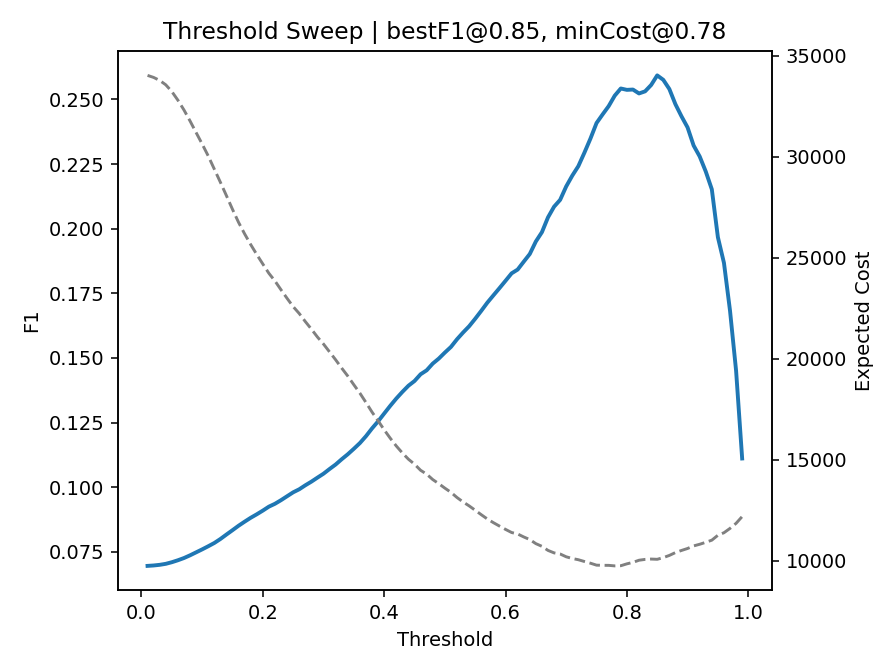

# data-hunt-fraud-m5
[](https://github.com/yokea1/data-hunt-fraud-m5/actions)
[](https://github.com/yokea1/data-hunt-fraud-m5/actions)


**Cost-Sensitive, Time-Split Benchmark for IEEE-CIS Fraud & M5 (with Calibration & Threshold Sweep)**

> We turn traditional AUC/PR evaluation into **Expected-Cost** evaluation under **temporal drift**, and we make it **reproducible** (scripts + figures + fixed seeds).

---

## 1. Why this repo
- **Business-aligned**: we optimize **decision thresholds** by Expected Cost, not only by F1/AUC.
- **Temporal-robust**: time-split + rolling-origin style evaluation, closer to real deployment.
- **Calibrated**: reliability diagrams + ECE to avoid overconfident fraud scores.
- **Artifact-first**: everything goes to `reports/` → easy to review / share / demo.

---

## 2. Highlights
- **Best-F1 ≠ Min-Cost**: under asymmetric loss (e.g. FP:FN = 1:10), the threshold that minimizes Expected Cost is **usually lower** than the threshold that maximizes F1 → fewer FN → lower business loss.
- **Cost-aware sweeps**: we sweep thresholds once, but we can read off both **F1** and **cost** curves.
- **Reproducible**: fixed seeds, fixed folds, fixed paths.

---

## 3. Repo structure
```text
data-hunt-fraud-m5/
├─ fraud_baseline.py               # IEEE-CIS fraud baseline runner
├─ m5_baseline.py                  # M5 forecasting baseline runner
├─ scripts/
│  ├─ plot_reliability.py
│  └─ plot_expected_cost.py
├─ reports/
│  └─ figs/                        # all the figures below
├─ tests/
│  └─ test_runs.py                 # minimal CI: can this repo run?
├─ .github/workflows/ci.yml        # run pytest
├─ .github/workflows/lint.yml      # run pre-commit
├─ requirements.txt
├─ .gitignore
└─ README.md
4. Quickstart
bash
复制代码
python -m venv .venv && source .venv/bin/activate
pip install -r requirements.txt

# run baselines
python fraud_baseline.py
python m5_baseline.py

# make plots (if you don't have real preds yet, scripts will synthesize data)
python scripts/plot_reliability.py --out reports/figs/reliability.png
python scripts/plot_expected_cost.py --out reports/figs/fraud_expected_cost.png
5. Results — IEEE-CIS Fraud
Key numbers (HistGradientBoosting, test):

PR-AUC 0.4616

ROC-AUC 0.8776

F1@0.50 0.3767

Validation: best-F1 ≈ 0.72, min-cost ≈ 0.56 (FP:FN = 1:10)

Why it matters: if your fraud team cares more about missing a fraud (FN) than wrongly flagging a normal transaction (FP), you should pick the min-cost threshold, not the F1 one.

5.1 Curves

Figure 1. Precision–Recall for a logistic-style baseline.


Figure 2. PR curve for HGB; better separation on tail classes.


Figure 3. Expected-Cost vs Threshold. Dashed / dotted lines mark min-cost and best-F1.


Figure 4. One sweep → two readings: F1 (solid) and Expected Cost (dashed).

5.2 Confusion matrices

Figure 5. Confusion matrix at best-F1 threshold.


Figure 6. Confusion matrix at the “naive” 0.50 threshold (for comparison).

6. Calibration

Figure 7. Reliability / calibration plot. Closer to y = x → better calibrated probabilities → more trustworthy for cost/thresholding.

7. Results — M5 Forecasting
Wide → long conversion.

Feature set: lag1/7/28, rolling_mean_7, calendar (weekday, month, holiday).

3-fold expanding-window backtesting.

Example improvement: Naive(t−1) → Ridge → MAE 0.7097 → 0.4961, MAPE 69.35% → 47.30%.

Fold-wise metrics saved under reports/.


Figure 8. Expanding-window backtest; last fold shown.

8. Data placement
IEEE-CIS CSV → data/ieee/

M5 CSV → data/m5/

We do not ship raw competition data; please download from the original source and respect the licenses.

9. Reproducibility & CI
tests/: runs both fraud and M5 pipelines (skips if file missing)

.github/workflows/: CI (pytest) + lint (pre-commit)

pre-commit: trims trailing spaces, enforces final newlines, runs Black/Ruff/Isort (can be disabled per file if needed)

10. Citation
If this repo helps your research/engineering/coursework, please star ⭐ and cite a tagged release, e.g.:

text
复制代码
@software{data-hunt-fraud-m5,
  title  = {Cost-Sensitive, Time-Split Benchmark for IEEE-CIS Fraud & M5},
  author = {<Your Name>},
  year   = {2025},
  url    = {https://github.com/yokea1/data-hunt-fraud-m5},
  note   = {Version v1.0.1}
}
11. License
MIT

## 📊 Results

**Fraud (IEEE-CIS)**
- **Best-F1 ≠ Min-Cost**: under FP:FN=1:10 the cost-optimal threshold is typically **lower** than best-F1 → fewer **FN** and lower business loss.
- Test (HGB): **PR-AUC 0.4616**, **ROC-AUC 0.8776**, **F1@0.50 0.3767**; **best-F1 ≈ 0.72**, **min-cost ≈ 0.56** (valid).





**Calibration**

*Reliability diagram; closer to y=x indicates better calibration.*

**M5 (Forecasting)**

*Expanding-window backtest; last fold shown.*
